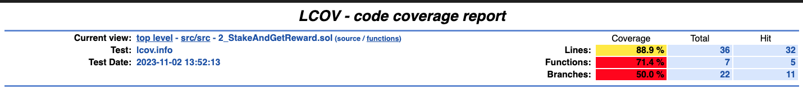
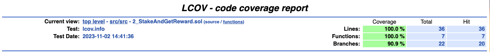

# StakeAndGetReward Test Coverage

Run test coverage with: 
```forge coverage --report lcov && genhtml lcov.info --branch-coverage --output-dir coverage```

Branches are not showing 100%, and it is because of forge issue dcumented here: 
- https://github.com/foundry-rs/foundry/issues/3497
  - `forge coverage considers branches partially covered`


## Old Coverage




## New Coverage

