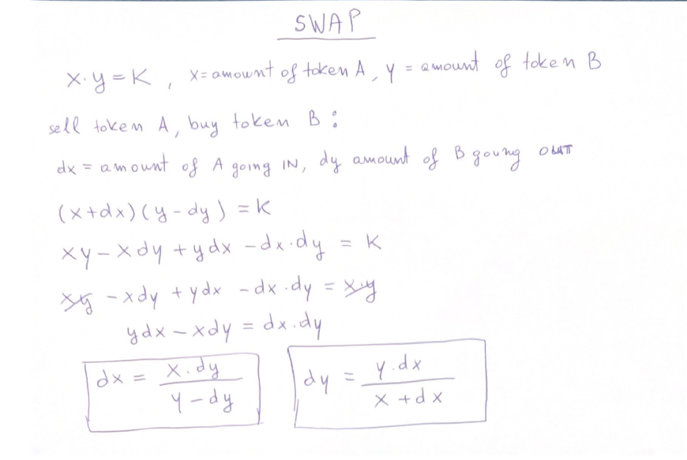

# Math behind - Uniswap V2

## SWAP

## ADD LIQUIDITIY

## ADD LIQUIDITIY - MINT

## REMOVE LIQUIDITIY - BURN

## PROTOCOL FEE
1/6th of Liquidity provider fees. Instead of calculating it on each swap it is calculated only on `mint` or `burn` 
on accumulated fees.  

