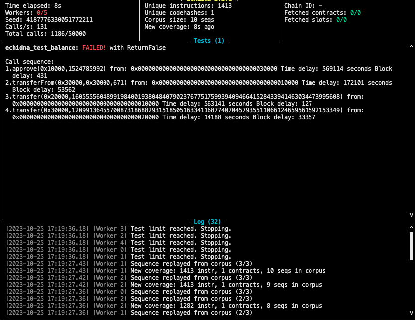

## Token Whale Challenge

## Echinda
Run Echidna:
```
docker run --platform=linux/amd64 --rm -it -v `pwd`:/src ghcr.io/crytic/echidna/echidna bash -c "solc-select install 0.7.0 && solc-select use  0.7.0 && echidna --contract TokenWhaleChallengeEchidna src/contracts/TokenWhaleChallengeEchidna.sol --config src/config.yaml"
```

Has broke contract.

- addres A has balance of 1000 tokens.
- address A approved address B to allowance of some number
- then address B calls `transferFrom(A, A, 671)` using amount less than 1000, which is maximum A can send.
- as `transferFrom` is calling internally `_transfer` which is then updating balance of `msg.sender` and sender in this case is `B` and address `B` does not have balance, underflow happens.
- which is resulting `B` has now huge aount of tokens and can send that tokens to anyone.



## Hardhat
Run: 
- `npm install`
- `npx hardhat test --verbose`


