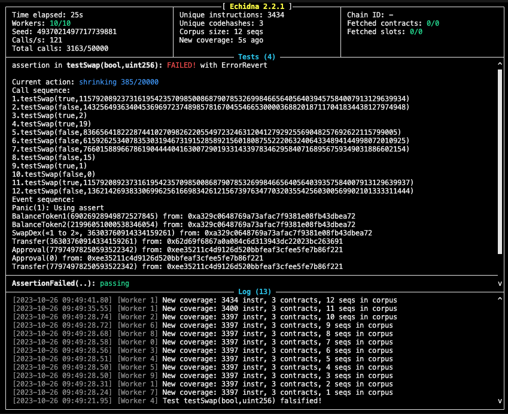

## Ethernaut DEX 1

https://ethernaut.openzeppelin.com/level/22

## Echidna

Run Echidna:
```
docker run --platform=linux/amd64 --rm -it -v `pwd`:/src ghcr.io/crytic/echidna/echidna bash -c "solc-select install 0.8.21 && solc-select use  0.8.21 && echidna --contract DexEchidna src/contracts/DexEchidna.sol --config src/config.yaml"
```


Issue is in function: 
```
  function getSwapPrice(address from, address to, uint amount) public view returns(uint){
    return((amount * IERC20(to).balanceOf(address(this)))/IERC20(from).balanceOf(address(this)));
  }
```

It is calculating amount to go out by dividing balances of contract and multiplying it with amount in. 
Initial state is ok as ratio is 1:1 (100:100), but later after first swap if we call first from `token1 -> token2` 
and then `token2 -> token1` we can get more out then we have sent in in previous steps. 




# Swap
| DEX Token1   |      DEX Token2   | USER Token1   |      USER Token2   |
|--------------|:-------------:|-------------------:|------------------:|
| 100 |  100 | 10 | 10 |
| 110 |   90 |  0 | 20 |   
| 86  |  110 | 24 | 0  |  
| 110 |  80  | 0  | 30 |   
| 69  |  110 | 41 | 0  |  
| 110 |  45  | 0  | 65 |  
| 0   |  90  | 110| 20 |


Each swap we swap all we have from token that we get in last swap, except in the las step, where we ned to calculate how mush we need to send of Token2 to drain all Token1 from DEX.

amount * 110 / 45 = 110 (Token1 dex balance)
amount = 45

We need to send in last step 45 Token2 to drain all Token1.


